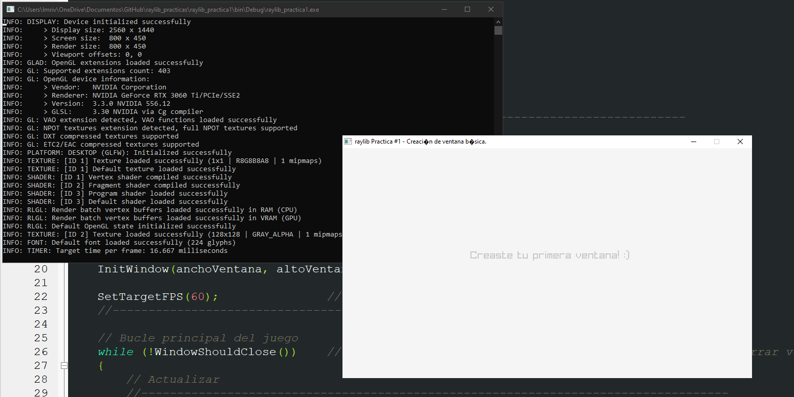

# Prácticas raylib.
Introducción al desarrollo de videojuegos en lenguaje C.

### Contenido:
- Práctica 1: Configuración del ambiente de desarrollo, compilador y creación de la primera ventana.
- Práctica 2: Dibujo de formas básicas y manejo de eventos con el teclado. Crear figuras básicas usando vectores2d y a cambiar su posición usando el teclado.
- Práctica 3: Animaciones básicas. Es un avance de la práctica 2, en donde se crearán figuras pero implementando "animaciones" para que los objetos se muevan por sí mismos.
- Práctica 4: Combinación de la práctica 2 y 3, y agregar colisiones. Usar lo aprendido en las prácticas 2 y 3 para crear un objeto que se mueva por sí solo, así como un objeto controlado por el usuario, e integrar el concepto de colisiones para que estos dos objetos interactuen entre ellos.
- Práctica 5: Avance de la práctica 4 y producto final. Tomamos la práctica 4 pero agregamos el concepto de la gravedad para crear un plataformero. También se puede incluir la generación de plataformas en las cuales el jugador puede saltar.

### Prerrequisitos:
- Descargar e instalar [Code::Blocks](https://www.codeblocks.org/).
- Descargar e instalar [raylib](https://www.raylib.com/index.html).

### Configuración en Code::Blocks:
1. Abrir Code::Blocks e ir a "Settings > Compiler...".

2. Seleccionar cualquier compilador y haz click en "Copy".

3. Agrega un nombre para el nuevo compilador.

4. En la pestaña de "Toolchain executables" estableces el directorio de instalación del compilador. Este debe apuntar a donde se encuentra la carpeta "bin" la cual contiene los compiladores. La ruta predeterminada es "C:\raylib\w64devkit".
   

5. En la pestaña de "Search directories", seleccionar la pestaña de "Compiler" y agregar la ruta hacia la carpeta "include". La ruta predeterminada es "C:\raylib\w64devkit\x86_64-w64-mingw32\include".

6. En la pestaña de "Search directories", seleccionar la pestaña de "Linker" y agregar la ruta hacia la carpeta "lib". La ruta predeterminada es "C:\raylib\w64devkit\x86_64-w64-mingw32\lib".

7. En la pestaña de "Linker settings", Agregar las siguientes librerias que se encuentran en la carpeta lib. La ruta predeterminada donde se encuentran las librerias es "C:\raylib\w64devkit\x86_64-w64-mingw32\lib".
   - librarylib.a
   - libopengl32.a
   - libgdi32.a
   - libwinmm.a
   - libm.a
   - libcomdlg32.a
   - libole32.a

8. Click OK.
9. Abrir la práctica 1 de este repo.

10. Click derecho en el proyecto y seleccionar "Build options...".

11. Seleccionar el proyecto (Debug, Release o el proyecto completo) y asegurarse de que el compilador seleccionado sea el configurado previamente.

12. Compilar y correr el proyecto :).

